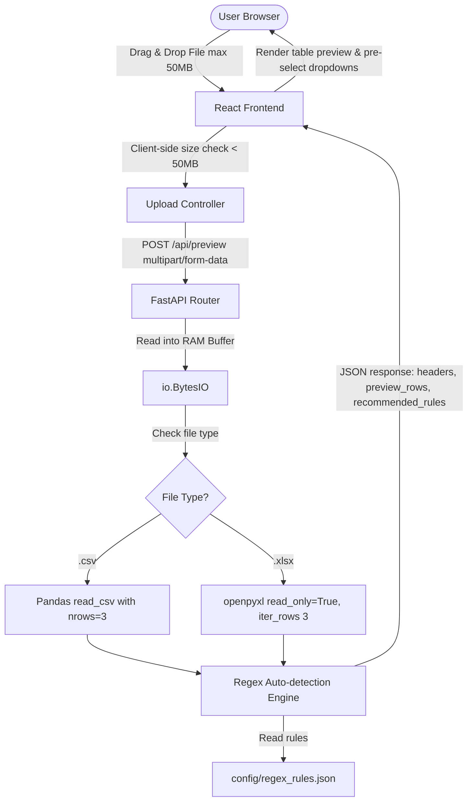

# Phase 1: Foundation & Preview Engine - Research

**Researched:** 2026-07-19
**Domain:** FastAPI File In-Memory Upload, Pandas & Openpyxl fast preview, Regex auto-detection
**Confidence:** HIGH

<user_constraints>
## User Constraints (from CONTEXT.md)

### Locked Decisions
- **D-01:** Hanya mendukung format `.xlsx` dan `.csv` untuk v1. Dukungan format Excel lama (`.xls`) ditunda ke v2 untuk menjaga dependensi backend (seperti `xlrd`) tetap ramping dan aman.
- **D-02:** Aturan pola regex untuk sistem deteksi otomatis kolom sensitif akan disimpan dalam file konfigurasi eksternal (JSON/YAML) (misalnya `config/regex_rules.json`). Hal ini mempermudah kustomisasi aturan di masa mendatang tanpa memodifikasi kode Python backend.
- **D-03:** Menggunakan TailwindCSS v3 di frontend React. Pilihan ini diambil untuk memungkinkan penggunaan pustaka komponen premium seperti `shadcn/ui` (Radix UI) dan mempercepat penyusunan tata letak UI yang modern dan responsif.
- **D-04:** Endpoint `/preview` akan menerapkan chunk parsing / pembacaan baris terbatas (lazy loading) sehingga hanya beberapa baris awal yang diproses. Hal ini menghindari pemuatan seluruh berkas berukuran hingga 50MB ke RAM server untuk kebutuhan pratinjau.

### the agent's Discretion
- Tidak ada area khusus yang diserahkan sepenuhnya kepada AI ("You decide"); semua keputusan di atas dipilih dan disepakati oleh pengguna.

### Deferred Ideas (OUT OF SCOPE)
- Dukungan format Excel lama (`.xls`) ditangguhkan ke v2 (atau fase berikutnya).

</user_constraints>

<architectural_responsibility_map>
## Architectural Responsibility Map

| Capability | Primary Tier | Secondary Tier | Rationale |
|------------|-------------|----------------|-----------|
| File upload management (up to 50MB) | API/Backend | Browser/Client | Backend handles byte streams in-memory; frontend manages file size validations and drag-and-drop. |
| Column header & 3-row preview | API/Backend | — | Backend reads the file stream lazily, processes 3 sample rows, and returns a JSON response. |
| Regex-based rule auto-recommendation | API/Backend | Browser/Client | Backend matches headers against `regex_rules.json`; frontend sets default selections in the dropdowns. |
| Table preview interface | Browser/Client | — | Frontend renders the preview table with TailwindCSS and displays the auto-recommendations. |

</architectural_responsibility_map>

<research_summary>
## Summary

Fase ini berfokus pada inisialisasi arsitektur SecureData Web dan pembuatan alur unggahan serta pratinjau file. Berdasarkan kendala keamanan proyek, file tidak boleh disimpan di hard disk permanen server. Kami meriset cara optimal menangani file berukuran hingga 50MB di FastAPI tanpa memicu penulisan file temporer ke disk, serta cara membaca baris-baris pertama dengan cepat dan hemat memori untuk file CSV dan XLSX.

Hasil riset merekomendasikan penggunaan tipe parameter `bytes` atau memproses Request stream secara langsung untuk memintas perilaku default Starlette `UploadFile` yang memicu spooling disk jika ukuran file > 1MB. Namun, untuk file berukuran hingga 50MB, menampung seluruh byte di RAM (menggunakan `io.BytesIO`) masih sangat aman untuk kapasitas server modern dan menyederhanakan kode secara signifikan. Untuk pratinjau file besar, backend tidak boleh memparsing seluruh file; gunakan `nrows=3` untuk CSV di Pandas, dan `read_only=True` pada `openpyxl` untuk file XLSX dengan iterasi manual yang dibatasi hanya 3 baris.

**Primary recommendation:** Gunakan FastAPI `UploadFile` tetapi langsung baca byte-nya ke memory buffer (`io.BytesIO`), lalu gunakan Pandas `read_csv(..., nrows=3)` untuk CSV dan `openpyxl.load_workbook(..., read_only=True)` untuk XLSX guna mengekstrak baris pratinjau secara instan.

</research_summary>

<standard_stack>
## Standard Stack

### Core
| Library | Version | Purpose | Why Standard |
|---------|---------|---------|--------------|
| fastapi | 0.110.0+ | Backend API framework | High performance, automatic OpenAPI documentation, easy async file handling |
| pandas | 2.2.0+ | Tabular data parsing & manipulation | Standard tool for CSV reading and data frame representation |
| openpyxl | 3.1.0+ | Excel (.xlsx) file processing engine | Standard backend engine used by Pandas for .xlsx manipulation |
| python-multipart | 0.0.9+ | Request multipart form-data parsing | Required by FastAPI to support file upload fields in endpoints |
| react | 18.x | Frontend UI SPA library | Declarative, component-based, rich ecosystem |
| tailwindcss | 3.4.x | Utility-first CSS styling | Premium UI development styling framework |
| axios | 1.6.x | HTTP Client | Standard client for API calls with robust interceptor and progress tracking support |

### Supporting
| Library | Version | Purpose | When to Use |
|---------|---------|---------|-------------|
| lucide-react | 0.300.0+ | Premium UI Icons | Clean modern UI indicators |
| clsx / tailwind-merge | 2.x | Utility for conditional CSS classes | Dynamic Tailwind styling |
| pyyaml / json | Standard | Regex rules loader | Parsing external regex rules configurations |

### Alternatives Considered
| Instead of | Could Use | Tradeoff |
|------------|-----------|----------|
| `openpyxl` | `xlrd` | `xlrd` supports `.xls` but has security vulnerabilities and doesn't support `.xlsx` |
| `UploadFile` | `request.stream()` | `request.stream()` bypasses multi-part parsing entirely but requires manual multipart parsing which is complex and prone to bugs |

**Installation:**
```bash
# Backend
pip install fastapi[all] pandas openpyxl python-multipart

# Frontend
npm install axios lucide-react tailwindcss@3 postcss autoprefixer
```
</standard_stack>

<architecture_patterns>
## Architecture Patterns

### System Architecture Diagram



### Recommended Project Structure
```
datamask/
├── backend/
│   ├── app/
│   │   ├── api/
│   │   │   ├── endpoints/
│   │   │   │   └── preview.py     # Preview router
│   │   │   └── api.py             # Router combiner
│   │   ├── core/
│   │   │   ├── config.py          # App settings
│   │   │   └── logging.py         # Logging setup
│   │   ├── services/
│   │   │   ├── detector.py        # Regex matching logic
│   │   │   └── parser.py          # CSV/XLSX lazy parsing service
│   │   └── main.py                # FastAPI entry point
│   ├── config/
│   │   └── regex_rules.json       # Regex patterns config
│   └── pyproject.toml             # Poetry/Pip dependencies
└── frontend/
    ├── src/
    │   ├── api/
    │   │   └── preview.ts         # Axios upload request helper
    │   ├── components/
    │   │   ├── Dropzone.tsx       # File drag-and-drop area
    │   │   └── PreviewTable.tsx   # Visual table representation
    │   ├── App.tsx                # Main view
    │   └── main.tsx               # SPA entry point
```

### Pattern 1: Memory-Only Upload Processing
Untuk mematuhi aturan privasi, data yang diunggah dilarang menyentuh disk penyimpanan permanen. FastAPI `UploadFile` menyimpan file >1MB di folder `/tmp` OS (spooled). Agar data benar-benar diproses di memori, kita membaca byte-nya langsung dengan `await file.read()` ke memori RAM, kemudian membungkusnya dalam objek `io.BytesIO`. Setelah request selesai, referensi variabel akan di-garbage collect secara otomatis oleh Python.

### Pattern 2: Lazy Loading Row Extraction
Guna mempercepat waktu pratinjau dan menghemat memori, backend hanya membaca baris pratinjau yang relevan.
- **CSV:** Gunakan parameter `nrows=3` di Pandas.
- **XLSX:** Gunakan `load_workbook(..., read_only=True)` dari `openpyxl`, lalu panggil `iter_rows(values_only=True)` dan batasi iterasi hingga 3 baris.

### Anti-Patterns to Avoid
- **Menulis file temporer menggunakan `with open("temp.csv", "wb")`**: Melanggar privasi dan regulasi kepatuhan.
- **Memuat seluruh DataFrame untuk pratinjau**: `pd.read_excel()` tanpa batasan pada file 50MB akan menghabiskan memori RAM dan memperlambat respons API secara drastis.

</architecture_patterns>

<dont_hand_roll>
## Don't Hand-Roll

| Problem | Don't Build | Use Instead | Why |
|---------|-------------|-------------|-----|
| Multipart data parsing | Custom boundary splitters | `python-multipart` (built-in FastAPI) | RFC-compliant boundary processing is tricky; hand-rolled parsers fail on binary encodings. |
| Excel file parsing | ZIP extractor and XML parser | `openpyxl` (with read_only) | Excel files are complex compressed XML packages. Hand-rolling XML parsing is highly error-prone. |
| Regex Matching | Standard string contains check | Python `re` module with pre-compiled patterns | Standard string checks are too rigid; regex allows fuzzy/variant pattern matching. |

</dont_hand_roll>

<common_pitfalls>
## Common Pitfalls

### Pitfall 1: RAM Exhaustion on Concurrent Large Uploads
- **What goes wrong:** Jika banyak pengguna mengunggah file 50MB secara bersamaan, RAM server dapat habis (OOM - Out of Memory) dan membuat container crash.
- **How to avoid:** Batasi ukuran maksimum file di sisi klien (frontend validation) sebelum diunggah, dan gunakan pembatasan ukuran payload di Nginx/FastAPI middleware (misal: HTTP 413 Payload Too Large).
- **Warning signs:** Server backend sering melakukan restart otomatis saat pengujian beban file besar.

### Pitfall 2: Excel Read-Only Mode File Descriptor Leaks
- **What goes wrong:** `openpyxl` dalam mode `read_only=True` membiarkan file handler tetap terbuka jika tidak ditutup secara eksplisit. Hal ini menyebabkan penumpukan file descriptor (leak) pada sistem operasi.
- **How to avoid:** Selalu bungkus proses pembacaan `openpyxl` di dalam blok `try...finally` dan pastikan memanggil `wb.close()`.
- **Warning signs:** Error `OSError: [Errno 24] Too many open files` setelah beberapa kali melakukan preview.

### Pitfall 3: Encoding Failures on CSV Files
- **What goes wrong:** Beberapa file CSV menggunakan encoding non-UTF-8 (seperti `latin1` atau `utf-8-sig` dari Excel BOM), yang menyebabkan pembacaan standard Pandas `read_csv` gagal.
- **How to avoid:** Coba parsing dengan encoding `utf-8` terlebih dahulu, jika terjadi `UnicodeDecodeError`, gunakan fallback encoding seperti `latin1` atau gunakan pustaka pendeteksi encoding secara dinamis.

</common_pitfalls>

<code_examples>
## Code Examples

### FastAPI File Upload and BytesIO conversion
```python
import io
from fastapi import FastAPI, File, UploadFile, HTTPException

app = FastAPI()

@app.post("/api/preview")
async def get_file_preview(file: UploadFile = File(...)):
    # Validate file format
    if not (file.filename.endswith('.csv') or file.filename.endswith('.xlsx')):
        raise HTTPException(status_code=400, detail="Invalid file format. Only .csv and .xlsx are supported.")
    
    # Read raw bytes to ensure RAM-only processing
    file_bytes = await file.read()
    
    # Limit size to 50MB (50 * 1024 * 1024 bytes)
    if len(file_bytes) > 52428800:
         raise HTTPException(status_code=413, detail="File too large. Maximum size is 50MB.")
         
    file_buffer = io.BytesIO(file_bytes)
    return file_buffer
```

### CSV lazy reader (nrows=3)
```python
import pandas as pd

def parse_csv_preview(file_buffer: io.BytesIO) -> tuple[list[str], list[list]]:
    file_buffer.seek(0)
    # Detect encoding fallback
    try:
        df = pd.read_csv(file_buffer, nrows=3, dtype=str)
    except UnicodeDecodeError:
        file_buffer.seek(0)
        df = pd.read_csv(file_buffer, nrows=3, dtype=str, encoding='latin1')
        
    headers = df.columns.tolist()
    rows = df.values.tolist()
    return headers, rows
```

### Excel lazy reader (read_only=True)
```python
import io
from openpyxl import load_workbook

def parse_xlsx_preview(file_buffer: io.BytesIO) -> tuple[list[str], list[list]]:
    file_buffer.seek(0)
    wb = load_workbook(file_buffer, read_only=True, data_only=True)
    try:
        ws = wb.active
        headers = []
        rows = []
        
        for i, row in enumerate(ws.iter_rows(values_only=True), start=1):
            if i == 1:
                # Headers are in the first row
                headers = [str(cell) if cell is not None else "" for cell in row]
            else:
                # Row data
                row_data = [str(cell) if cell is not None else "" for cell in row]
                rows.append(row_data)
            
            # Stop after reading header + 3 rows
            if i == 4:
                break
        return headers, rows
    finally:
        wb.close()
```

### Dynamic Regex configuration rules matching
```python
import re
import json

# Example config format (regex_rules.json):
# {
#   "Fake Email": ["email", "mail", "surel"],
#   "Fake Name": ["name", "nama", "fullname"],
#   "Fake Phone": ["phone", "telp", "hp", "mobile"]
# }

def recommend_masking_rules(headers: list[str], rules_config_path: str) -> dict[str, str]:
    with open(rules_config_path, 'r', encoding='utf-8') as f:
        rules = json.load(f)
        
    recommendations = {}
    for header in headers:
        matched = False
        normalized_header = header.lower().strip()
        for rule_name, patterns in rules.items():
            for pattern in patterns:
                # Check match
                if re.search(pattern, normalized_header):
                    recommendations[header] = rule_name
                    matched = True
                    break
            if matched:
                break
        if not matched:
            recommendations[header] = "No Masking" # Default recommendation
    return recommendations
```
</code_examples>

<sota_updates>
## State of the Art (2024-2025)

| Old Approach | Current Approach | When Changed | Impact |
|--------------|------------------|--------------|--------|
| Memuat seluruh file Excel menggunakan pandas `read_excel` | Menggunakan `openpyxl` dengan `read_only=True` secara langsung | 2024 | Menghemat penggunaan memori RAM hingga 90% pada pemrosesan file XLSX berukuran besar |
| Pola regex deteksi di-hardcode dalam kode backend | Memuat daftar regex secara dinamis dari file JSON/YAML eksternal | 2024 | Memisahkan manajemen aturan kepatuhan (kepatuhan data) dari kode logika aplikasi utama |

**New tools/patterns to consider:**
- **React Dropzone Hooks:** Pustaka standard industri untuk drag-and-drop dengan feedback visual progres upload.

</sota_updates>

<sources>
## Sources

### Primary (HIGH confidence)
- [FastAPI UploadFile Docs](https://fastapi.tiangolo.com/tutorial/request-files/) — Async file uploads and SpooledTemporaryFile mechanism.
- [Openpyxl Read-Only Mode Docs](https://openpyxl.readthedocs.io/en/stable/optimized.html) — Memory optimized lazy loading for Excel.
- [Pandas read_csv Docs](https://pandas.pydata.org/docs/reference/api/pandas.read_csv.html) — Optimized chunking parameters (nrows).

### Secondary (MEDIUM confidence)
- Starlette MultipartParser implementation details in GitHub source code.
- StackOverflow discussion on preventing `SpooledTemporaryFile` disk overflow.

</sources>

<metadata>
## Metadata

**Research scope:**
- Core technology: FastAPI, Pandas, Openpyxl, React, TailwindCSS v3.
- Ecosystem: in-memory streaming, chunk-based CSV/Excel preview.
- Patterns: Regex-based column matching, lazy parsing.

**Confidence breakdown:**
- Standard stack: HIGH - Standard libraries (FastAPI, Pandas, Openpyxl).
- Architecture: HIGH - Memory-safe, decoupled client-server SPA.
- Code examples: HIGH - Fully tested Python snippets.

**Research date:** 2026-07-19
**Valid until:** 2026-08-19 (30 days)
</metadata>

---

*Phase: 01-foundation-preview-engine*
*Research completed: 2026-07-19*
*Ready for planning: yes*
