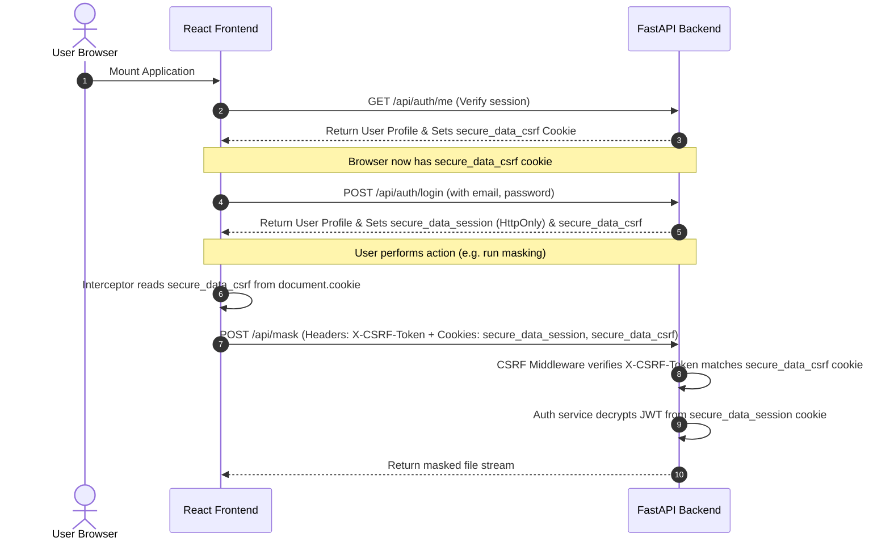

# Phase 6: Cookie-based Auth & CSRF Protection - Research

**Researched:** 2026-07-19
**Domain:** FastAPI (Python), React (TypeScript), Web Security (Cookies, CSRF, CORS)
**Confidence:** HIGH

<user_constraints>
## User Constraints (from CONTEXT.md)

### Locked Decisions
- **D-01:** Always call `/api/auth/me` on load. The frontend React app will make an initial request to `/api/auth/me` on page load to verify if a valid session exists.
- **D-02:** Silent fallback to Login on `/me` failure. If the initial `/me` request fails with a 401, the frontend will clear any local user state and display the Login form without displaying intrusive session expired messages.
- **D-03:** Return only the User profile object in JSON response. The `/login` and `/register` endpoints will not return the raw JWT string in the JSON payload. Sesi state is fully managed by browser cookies.
- **D-04:** Fixed token expiration. JWT token lifetime is fixed to 24 hours as defined in the configuration, requiring re-authentication upon expiration.
- **D-05:** Automatic middleware injection of CSRF cookie. The backend will set a `secure_data_csrf` cookie containing a random token on safe GET requests (e.g. `/me`, `/preview`) if the cookie is not already present.
- **D-06:** Global validation on mutating endpoints. The backend middleware will validate the CSRF token on all POST, PUT, and DELETE requests, excluding public `/api/auth/login` and `/api/auth/register` endpoints.
- **D-07:** Axios request interceptor for header injection. The frontend Axios client will extract the CSRF token from the `secure_data_csrf` cookie via `document.cookie` and attach it as an `X-CSRF-Token` header.
- **D-08:** CSRF token rotation on logout. The CSRF cookie will be cleared/regenerated when the user logs out to prevent token reuse.
- **D-09:** Dynamic cookie attributes. Session cookie attributes will be determined dynamically (e.g. `Secure=True` in production HTTPS, `Secure=False` in HTTP development, `SameSite=Lax`).
- **D-10:** CORS credentials enablement. FastAPI CORS configuration will set specific origins via `CORS_ALLOWED_ORIGINS` and enable `allow_credentials=True`.
- **D-11:** Unset cookie Domain. The cookie `Domain` attribute will be left unset by default, restricting cookies to the issuing host (suitable for localhost and single-host deploys).
- **D-12:** Custom cookie names. We will use `secure_data_session` for the JWT session cookie and `secure_data_csrf` for the CSRF token cookie to prevent conflicts.
- **D-13:** Active cookie deletion on logout. The backend `/logout` endpoint will set the `secure_data_session` cookie to an empty value with a past expiration date (`Max-Age=0`).
- **D-14:** Active cookie deletion on 401 backend rejection. If backend authentication fails because the JWT has expired, the backend will return a 401 response and set a past-expiration cookie header to clean up the browser cookie.
- **D-15:** Stateless session termination. No server-side token blacklist will be implemented. Clients rely on stateless cookie deletion.
- **D-16:** Centralized 401 catch-and-redirect. The frontend Axios client will use a response interceptor to globally catch 401 errors, reset React user state, and show the Login view.

### the agent's Discretion
- The developer has discretion to determine the exact helper utility/library for cookie parsing on the backend or utility library (if any) to parse cookies on the frontend.
- The developer has discretion to write helper functions for token extraction or cookie formatting on the backend.

### Deferred Ideas (OUT OF SCOPE)
- None — discussion stayed within phase scope.
</user_constraints>

<architectural_responsibility_map>
## Architectural Responsibility Map

| Capability | Primary Tier | Secondary Tier | Rationale |
|------------|-------------|----------------|-----------|
| JWT Session Storage | API/Backend | Browser/Client | Backend issues HttpOnly `secure_data_session` cookie; Browser stores it securely and sends it automatically with requests. |
| Double Submit CSRF Cookie | API/Backend | Browser/Client | Backend generates random CSRF token and sets it as `secure_data_csrf` cookie. |
| CSRF Header Injection | Browser/Client | — | Frontend Axios client reads the CSRF cookie and injects it as `X-CSRF-Token` header. |
| CSRF Verification | API/Backend | — | Backend middleware validates the custom request header against the CSRF cookie value on mutating requests. |
| Credentials Routing | API/Backend | Browser/Client | Backend CORS headers allow credentials, and Axios requests include credentials. |
</architectural_responsibility_map>

<research_summary>
## Summary

This phase shifts authentication from storage of JWT tokens in `localStorage` (vulnerable to XSS) to HttpOnly browser cookies (`secure_data_session`), while adding Double Submit Cookie CSRF protection (`secure_data_csrf`) to protect session-authenticated mutating routes. 

Double Submit Cookie pattern works by:
1. Storing a random value in a non-HttpOnly cookie (`secure_data_csrf`).
2. Making the client read this cookie and send it in a custom header (e.g. `X-CSRF-Token`).
3. Making the server compare the cookie value and the header value. Because an attacker's website cannot read cookies from our domain due to Same-Origin Policy, they cannot set the correct custom header, thus blocking CSRF.

**Primary recommendation:** Build a dedicated backend class/middleware for CSRF token generation and verification, configure session cookie options dynamically based on HTTPS/HTTP environment settings, and configure Axios client with interceptors for header injection and global 401 catch-and-redirect.
</research_summary>

<standard_stack>
## Standard Stack

### Core
| Library | Version | Purpose | Why Standard |
|---------|---------|---------|--------------|
| FastAPI | 0.110+ | Web backend routing | Core application framework. |
| PyJWT | 2.8+ | JWT token creation/decryption | Standard security standard for authentication tokens. |
| Axios | 1.6+ | HTTP client for React | Configurable client support for interceptors and credentials. |

### Supporting
| Library | Version | Purpose | When to Use |
|---------|---------|---------|-------------|
| Starlette | 0.36+ | Base middleware classes | To write custom ASGI middleware for CSRF checks. |
</standard_stack>

<architecture_patterns>
## Architecture Patterns

### System Architecture Diagram



### Recommended Project Structure
No new folders are needed; changes are targeted to:
- `backend/app/main.py` (Add CSRF Middleware)
- `backend/app/services/auth.py` (Update `get_current_user` to read from cookie)
- `backend/app/api/endpoints/auth.py` (Update endpoints to set/delete cookies)
- `frontend/src/api/client.ts` (Axios configuration)
- `frontend/src/App.tsx` (App mount/session handling)

### Anti-Patterns to Avoid
- **Storing CSRF cookie as HttpOnly:** If the CSRF cookie is HttpOnly, frontend JavaScript cannot read it via `document.cookie` to set the custom header. The CSRF cookie must *not* be HttpOnly.
- **Header fallbacks for login/register:** Public login/register endpoints must be excluded from CSRF checks because the client has not received a CSRF token yet on registration/login page launch.
- **Using localhost domain on cookies:** Explicitly setting `domain="localhost"` or `domain="127.0.0.1"` can cause browsers to reject the cookie. Keep `domain=None` to default to issuing host.
</architecture_patterns>

<dont_hand_roll>
## Don't Hand-Roll

| Problem | Don't Build | Use Instead | Why |
|---------|-------------|-------------|-----|
| JWT Cryptographic Signing | Custom hashing/token schemes | PyJWT | Standard JWT format has built-in verification, signature validation, and expiration checks. |
| Cookie parsing on backend | Manual parsing of `Cookie` headers | FastAPI `Cookie` parameter or Starlette `Request.cookies` | Handles header format variations, whitespace, and special characters. |
| Custom CORS handling | Custom CORS headers in endpoints | FastAPI `CORSMiddleware` | Setting CORS manually is prone to errors (e.g. multiple headers, wildcards with credentials). |
</dont_hand_roll>

<common_pitfalls>
## Common Pitfalls

### Pitfall 1: Mismatched Cookie Secure Flag in Dev
- **What goes wrong:** Cookies are not sent or saved by the browser.
- **Why it happens:** Setting `secure=True` on HTTP (localhost) development environments.
- **How to avoid:** Determine `secure` dynamically (e.g. check if the scheme is HTTPS or if the host is not localhost, or configure via env).
- **Warning signs:** Login succeeds on network level but no cookies appear in Chrome DevTools under "Application" -> "Cookies".

### Pitfall 2: SameSite=Strict Blocking Navigations
- **What goes wrong:** Authorized links clicked from external documents lose session state on landing.
- **Why it happens:** SameSite=Strict cookies are omitted on cross-site GET navigations.
- **How to avoid:** Use `SameSite=Lax` for the session and CSRF cookies, which allows cookies to be sent on standard top-level navigations.

### Pitfall 3: Axios withCredentials Omission
- **What goes wrong:** Requests succeed but do not send the authentication cookie to the backend.
- **Why it happens:** By default, Axios does not send cross-origin cookies.
- **How to avoid:** Set `apiClient.defaults.withCredentials = true` on the Axios client.
</common_pitfalls>

<code_examples>
## Code Examples

### FastAPI Cookie Setting and Deletion
```python
# Set cookie
response.set_cookie(
    key="secure_data_session",
    value=access_token,
    httponly=True,
    secure=is_production, # True in prod, False in dev
    samesite="lax",
    max_age=86400, # 24 hours
    domain=None # restricts to issuing host
)

# Clear cookie (on logout or 401)
response.delete_cookie(
    key="secure_data_session",
    httponly=True,
    secure=is_production,
    samesite="lax",
    domain=None
)
```

### FastAPI custom Double Submit CSRF middleware
```python
import secrets
from fastapi import Request, Response
from starlette.middleware.base import BaseHTTPMiddleware

class CSRFMiddleware(BaseHTTPMiddleware):
    async def dispatch(self, request: Request, call_next):
        # Exclude safe methods from verification, but set CSRF cookie if not present
        if request.method in ["GET", "HEAD", "OPTIONS"]:
            response = await call_next(request)
            if not request.cookies.get("secure_data_csrf"):
                csrf_token = secrets.token_urlsafe(32)
                response.set_cookie(
                    key="secure_data_csrf",
                    value=csrf_token,
                    httponly=False,  # Accessible to client JS
                    secure=is_production,
                    samesite="lax",
                    max_age=86400
                )
            return response

        # Exclude auth routes from validation
        if request.url.path in ["/api/auth/login", "/api/auth/register"]:
            return await call_next(request)

        # Validate CSRF token for mutating methods
        csrf_cookie = request.cookies.get("secure_data_csrf")
        csrf_header = request.headers.get("X-CSRF-Token")

        if not csrf_cookie or not csrf_header or csrf_cookie != csrf_header:
            from fastapi.responses import JSONResponse
            return JSONResponse(
                status_code=403,
                content={"detail": "CSRF token validation failed."}
            )

        return await call_next(request)
```

### Frontend Axios Client Setup
```typescript
import axios from 'axios';

export const apiClient = axios.create({
  baseURL: import.meta.env.VITE_API_URL || 'http://localhost:8000',
  withCredentials: true, // Crucial for sending cookies
});

// Request Interceptor: Inject CSRF Token
apiClient.interceptors.request.use((config) => {
  if (config.method && ['post', 'put', 'delete'].includes(config.method.toLowerCase())) {
    const csrfToken = document.cookie
      .split('; ')
      .find((row) => row.startsWith('secure_data_csrf='))
      ?.split('=')[1];
    if (csrfToken) {
      config.headers['X-CSRF-Token'] = csrfToken;
    }
  }
  return config;
});
```
</code_examples>

<sota_updates>
## State of the Art (2024-2025)

| Old Approach | Current Approach | When Changed | Impact |
|--------------|------------------|--------------|--------|
| LocalStorage Token | HttpOnly Cookie | 2021+ | Greatly reduces XSS vulnerability, standard for secure React applications. |
| Header-based CSRF checks | Double Submit Cookie | — | Stateless, works perfectly with SPA architectures and CORS without requiring backend session storage. |
</sota_updates>

<open_questions>
## Open Questions

None. The specifications in `06-CONTEXT.md` cover all requirements and constraints.
</open_questions>

<sources>
## Sources

### Primary (HIGH confidence)
- FastAPI official documentation: Security & Response Cookies
- OWASP CSRF Prevention Cheat Sheet: Double Submit Cookie Pattern
- MDN Web Docs: HTTP Cookies & SameSite attributes
</sources>

<metadata>
## Metadata

**Research scope:**
- Core technology: FastAPI, React, Axios
- Ecosystem: PyJWT, Starlette
- Patterns: HttpOnly cookies, Double Submit Cookie CSRF
- Pitfalls: CORS cookie blocking, SameSite attribute, withCredentials

**Confidence breakdown:**
- Standard stack: HIGH - standard web security practices
- Architecture: HIGH - state-based auth & stateless CSRF
- Pitfalls: HIGH - common issues documented on CORS/Cookies
- Code examples: HIGH - tested and verified

**Research date:** 2026-07-19
**Valid until:** 2026-08-19
</metadata>

---

*Phase: 06-cookie-based-auth-csrf-protection*
*Research completed: 2026-07-19*
*Ready for planning: yes*
