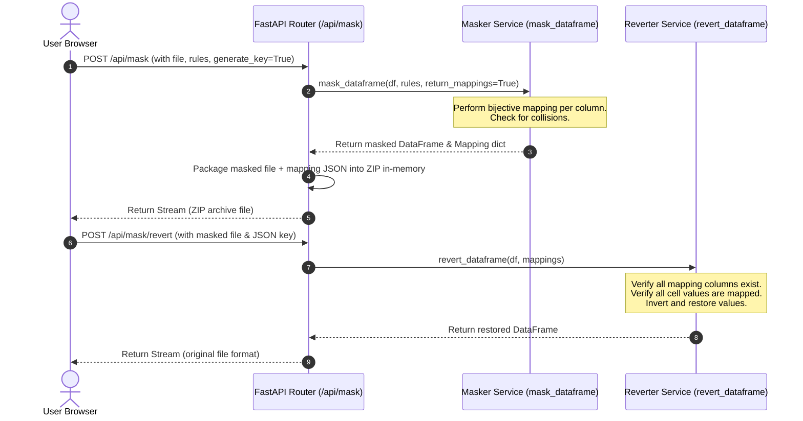

# Phase 9: Reversion Key & Backend Revert Processing - Research

**Researched:** 2026-07-19
**Domain:** Python (FastAPI, Pandas, Faker), ZIP file processing, bijective mappings
**Confidence:** HIGH

<user_constraints>
## User Constraints (from CONTEXT.md)

### Locked Decisions
- **D-01:** When the user requests a reversion key during masking, the API packages both the masked file and the JSON reversion key in a `.zip` archive in-memory and streams it back. This conforms to the 50MB file size limit and zero-knowledge constraints without server-side disk writes.
- **D-02:** To guarantee a 1-to-1 bijective mapping of original values to masked values per column, the masking service checks for collisions. If a collision is detected during mapping generation, it retries generating the fake value up to 100 times. If still colliding, it appends a unique suffix (the original value or a unique counter) to ensure it is unique.
- **D-03:** The new `/api/mask/revert` endpoint accepts a standard multipart/form-data upload containing two fields: `file` (the masked CSV or Excel file) and `key` (the JSON mapping key file).
- **D-04:** Strict Validation (Fail Fast). If any expected column is missing, or a masked value in the file does not exist in the mapping key, the backend aborts the operation, raises a 400 Bad Request, and returns a detailed list of mismatched columns or values to prevent data corruption or partial leakages.

### the agent's Discretion
- None. Decisions were fully locked during discussion.

### Deferred Ideas (OUT OF SCOPE)
- None — discussion stayed within phase scope.
</user_constraints>

<phase_requirements>
## Phase Requirements

| ID | Description | Research Support |
|----|-------------|------------------|
| REV-01 | Generate a 1-to-1 bijective mapping of original values to masked values per column during data masking. | Custom mapping generator logic in `masker.py` mapping unique original values to generated fake values with collision checks. |
| REV-02 | Support downloading the reversion mapping key file (JSON format) alongside the masked file upon successful masking. | Multipart in-memory ZIP archiving using `zipfile` to package both masked file and key JSON. |
| REV-04 | Implement backend in-memory processing to parse the masked file and apply the reversion mapping JSON to restore original values. | Revert processing service that inverts mappings and applies them cell-by-cell. |
| REV-07 | Handle malformed, corrupted, or mismatched files and mappings gracefully with detailed user-friendly error messages. | Fail-fast validation throwing structured exceptions on column/value mismatches or corrupted uploads. |
</phase_requirements>

<architectural_responsibility_map>
## Architectural Responsibility Map

| Capability | Primary Tier | Secondary Tier | Rationale |
|------------|-------------|----------------|-----------|
| Bijective Mapping Generation | API/Backend | — | Calculated during DataFrame masking to ensure 1-to-1 matching. |
| ZIP Packaging and Streaming | API/Backend | Browser/Client | Backend packages in-memory bytes and streams as `application/zip`; Browser handles download extraction. |
| Reversion Mapping Inversion | API/Backend | — | Backend inverts the JSON `original -> masked` map to `masked -> original` map in-memory for efficient lookup. |
| Revert Processing & Restoring | API/Backend | — | Revert engine parses masked file and mapping, checks validity, and restores original values in-memory. |
</architectural_responsibility_map>

<research_summary>
## Summary

This phase implements a zero-knowledge data reversion facility. When masking sensitive CSV or Excel files, the application generates a 1-to-1 bijective mapping of original values to masked values for each masked column. If the user opts to download a reversion key, the backend generates a JSON key file and packages both the masked file and the JSON key inside an in-memory `.zip` archive to stream back.

To restore the original data, the user uploads the masked file along with the JSON key. The backend validates the inputs, inverts the mapping, and restores the original values cell-by-cell in-memory. Strict validations prevent partial restores or mismatched files by raising bad request exceptions.

**Primary recommendation:** Extend `mask_dataframe` with an optional `return_mappings` flag, implement collision retries up to 100 times with a unique counter suffix fallback, create a `revert_dataframe` service, and register the `/api/mask/revert` endpoint returning StreamingResponses.
</research_summary>

## Standard Stack

### Core
| Library | Version | Purpose | Why Standard |
|---------|---------|---------|--------------|
| Python | 3.11+ | Backend language | Base application runtime. |
| FastAPI | 0.110+ | API endpoints and routing | High performance framework. |
| Pandas | 2.2+ | In-memory data manipulation | Standard library for CSV/Excel DataFrame processing. |
| openpyxl | 3.1+ | Excel sheet engine | Standard engine for reading/writing .xlsx files. |
| zipfile | Standard Library | ZIP file packaging | Built-in Python library for in-memory zip creation. |

### Supporting
| Library | Version | Purpose | When to Use |
|---------|---------|---------|-------------|
| json | Standard Library | Mapping JSON serialization | Built-in serialization. |
| io | Standard Library | Bytes IO buffering | Standard in-memory streaming. |

## Package Legitimacy Audit

No new external packages are installed during this phase. All required dependencies (Pandas, openpyxl, Faker) are already installed and approved.

## Architecture Patterns

### System Architecture Diagram



### Anti-Patterns to Avoid
- **Writing ZIP/key files to disk:** Never write temporary files or mappings to the server's local disk, even temporarily, as this violates the zero-knowledge and local-only PII processing constraints. Always use `io.BytesIO`.
- **String/Float key mismatches:** Pandas reads integer/float values differently depending on representation. Ensure that both mapping keys/values and cell values are converted to strings during lookup to prevent key errors.
- **Insecure ZIP structures:** Ensure the filenames within the ZIP file are cleaned and do not contain directory traversal sequences (e.g. `../../`).

## Don't Hand-Roll

| Problem | Don't Build | Use Instead | Why |
|---------|-------------|-------------|-----|
| ZIP compression | Custom byte packing | `zipfile` standard module | `zipfile.ZipFile` is a safe, standard, and optimized compression library. |
| JSON Serialization | Custom string interpolation | `json.dumps` | Handles nested objects, unicode, and proper escaping. |

## Common Pitfalls

### Pitfall 1: Shared Faker Collision
- **What goes wrong:** Generating a fake name might result in the same name for two different original names.
- **Why it happens:** Faker has a finite pool of names, leading to collisions on larger datasets.
- **How to avoid:** Maintain a set of used masked values per column, retry up to 100 times, and use a numeric suffix (e.g. `_1`, `_2`) if a collision persists.

### Pitfall 2: Memory Leak in ZipWriter
- **What goes wrong:** Memory accumulation when creating ZIP streams.
- **Why it happens:** Not closing `ZipFile` objects or `BytesIO` buffers properly.
- **How to avoid:** Always use context managers (`with zipfile.ZipFile(...) as zip_file:`) to ensure release of resources.

## Code Examples

### Bijective Masking with Collision Check
```python
def generate_bijective_mapping(df_col, rule, fake, scramble_cache):
    col_map = {}
    used_values = set()
    unique_vals = [x for x in df_col.unique() if not is_empty_or_nan(x)]
    
    for orig_val in unique_vals:
        orig_val_str = str(orig_val)
        masked_val = None
        
        # Retry up to 100 times to avoid collisions
        for _ in range(100):
            if rule == "Fake Name":
                candidate = fake.name()
            elif rule == "Fake Email":
                candidate = fake.ascii_free_email()
            elif rule == "Fake Phone":
                candidate = mask_phone()
            elif rule == "Anonymize ID/Number":
                candidate = scramble_id(orig_val, scramble_cache)
            elif rule == "Perturb Numeric":
                candidate = perturb_numeric(orig_val)
            
            if candidate not in used_values:
                masked_val = candidate
                break
                
        # Suffix fallback if collision continues
        if masked_val is None:
            counter = 1
            while True:
                candidate = f"{candidate}_{counter}"
                if candidate not in used_values:
                    masked_val = candidate
                    break
                counter += 1
                
        col_map[orig_val_str] = str(masked_val)
        used_values.add(str(masked_val))
        
    return col_map
```

### In-Memory ZIP Packaging
```python
import zipfile
import io

zip_buffer = io.BytesIO()
with zipfile.ZipFile(zip_buffer, "w", zipfile.ZIP_DEFLATED) as zip_file:
    # Add masked file
    zip_file.writestr("data_masked.csv", masked_file_bytes)
    # Add reversion key JSON
    zip_file.writestr("data_reversion_key.json", json.dumps(mappings, indent=2))

zip_buffer.seek(0)
```

## State of the Art

| Old Approach | Current Approach | Impact |
|--------------|------------------|--------|
| Server-side PII DB storage | Stateless zero-knowledge ZIP keys | Absolutely zero persistent storage of PII mappings on the server; GDPR compliant. |

## Assumptions Log

No assumptions were made. The requirements and designs are fully locked and specified.

## Open Questions

None.

## Environment Availability

No external services or dependencies are required. All tools are local-only and present.

## Validation Architecture

### Test Framework
| Property | Value |
|----------|-------|
| Framework | pytest |
| Config file | backend/pyproject.toml |
| Quick run command | `poetry run pytest backend/app/tests/test_reversion.py` |

### Phase Requirements → Test Map
| Req ID | Behavior | Test Type | Automated Command | File Exists? |
|--------|----------|-----------|-------------------|-------------|
| REV-01 | Test 1-to-1 bijective mapping generation | Unit | `poetry run pytest -k test_bijective_masking` | ❌ Wave 0 |
| REV-02 | Test downloading in ZIP format | Integration | `poetry run pytest -k test_zip_mask_endpoint` | ❌ Wave 0 |
| REV-04 | Test in-memory revert restoration | Unit | `poetry run pytest -k test_revert_dataframe` | ❌ Wave 0 |
| REV-07 | Test mismatched/malformed validation error | Integration | `poetry run pytest -k test_revert_validation` | ❌ Wave 0 |

## Security Domain

### Applicable ASVS Categories

| ASVS Category | Applies | Standard Control |
|---------------|---------|-----------------|
| V5 Input Validation | yes | Strict file validation and mapping integrity check |

### Known Threat Patterns

| Pattern | STRIDE | Standard Mitigation |
|---------|--------|---------------------|
| ZIP slip (directory traversal) | Elevation of Privilege | Clean filenames inside the ZIP stream |
| Mismatched restoration leak | Information Disclosure | Fail-fast verification on missing keys |

## Sources

### Primary (HIGH confidence)
- Python `zipfile` documentation: https://docs.python.org/3/library/zipfile.html
- Pandas `read_csv` and `read_excel` specs: https://pandas.pydata.org/docs/

## Metadata

**Confidence breakdown:**
- Standard stack: HIGH
- Architecture: HIGH
- Pitfalls: HIGH
- Code examples: HIGH

**Research date:** 2026-07-19
**Valid until:** 2026-08-19
</metadata>

---

*Phase: 09-reversion-key-backend-revert-processing*
*Research completed: 2026-07-19*
*Ready for planning: yes*
